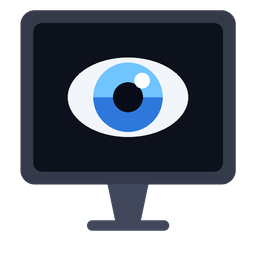

<p align="center">
  
</p>

<h1 align="center">EyeGuard</h1>
<p align="center"><b>Adaptive screen brightness &amp; eye comfort for Windows</b></p>

<p align="center">
  
  
  
</p>

---

EyeGuard watches the **app and tab** you're working in, reads how **bright the
on-screen content** is, and automatically adjusts your display brightness to
match. Dark content (code, dark mode, videos) gets brighter; white/paper
documents get dimmer — plus an optional **warm "eye protection"** tint that
reduces blue light and eye strain.

It runs quietly in the system tray, has a clean **dark-themed** settings window,
and every behavior is toggleable and customizable.

##  Features

- **Content-aware brightness** — samples the active window's average luminance
  and maps it to a target brightness with a smoothstep curve (no harsh jumps).
- **App / tab aware** — detects the foreground process *and* window title, so
  browser-hosted documents and editors each get the right behavior.
- **Eye protection** — a warm blue-light tint plus an optional extra dim,
  triggered automatically on white/paper content, per-app, or always-on.
- **Video pause** — holds brightness steady while you watch YouTube/Netflix/
  VLC/etc. so playback is never disturbed (keyword list is configurable).
- **All monitors** — external monitors via DDC/CI backlight; the laptop panel
  via a translucent overlay dimmer (works even on dGPU/MUX laptops where WMI
  backlight control is broken).
- **Per-app rules** — regex rules can force a fixed brightness or force eye
  protection on/off for specific apps.
- **Smooth transitions** — fast (configurable) ramping with no flicker.
- **Manual override** — drag a slider to pin brightness until you switch apps.
- **Restores your settings on exit** — returns every display to its original
  brightness and clears the color tint.

##  Installation

Requirements: **Windows 10/11** and **Python 3.9+** (tested on 3.13).

```powershell
git clone https://github.com/ibrra3/EyeGuard.git
cd EyeGuard
python -m venv .venv
.\.venv\Scripts\Activate.ps1
pip install -r requirements.txt
```

> Dependencies: `pywin32` (WMI backlight), `pystray` (tray icon), `Pillow`
> (icon rendering).

##  Running

```powershell
python main.py
```

An **eye-in-screen** icon appears in the system tray. Right-click it:

| Menu item | Action |
| --- | --- |
| **Open Settings** | configure everything below |
| **Test laptop dim** | flashes the laptop panel so you can confirm it responds |
| **Auto-adjust brightness** | master on/off |
| **Eye protection** | eye-protection on/off |
| **Pause during videos** | hold brightness during video playback |
| **Resume auto** | clears a manual brightness pin |
| **Quit** | restores original brightness + neutral color, then exits |

##  Settings

| Tab | Options |
| --- | --- |
| **General** | master enable, poll interval, active-window vs full-screen sampling, transition speed, video-pause toggle + keywords, manual override slider |
| **Brightness** | brightness for dark content, brightness for white content, min/max bounds, overlay dimming for the laptop panel |
| **Eye Protection** | enable, always-on, auto-trigger on white content, warmth, extra dim %, white-content threshold |
| **Monitors** | read-only list of detected displays |
| **App Rules** | add/edit/delete regex rules (name, match, brightness, eye protection) |

##  Configuration file

Settings persist to `%APPDATA%\EyeGuard\config.json` (a previous `BrightFlow`
config is migrated automatically). You can edit it directly while the app is
closed:

```jsonc
{
  "enabled": true,
  "interval_seconds": 1.5,
  "luma_sample_mode": "foreground",   // or "fullscreen"
  "brightness": {
    "dark_target": 85,   // brightness when content is dark
    "bright_target": 40, // brightness when content is white
    "min": 10, "max": 100,
    "max_step_per_sec": 60,            // transition speed
    "use_software_for_internal": true  // overlay dim for the laptop panel
  },
  "eye_protection": {
    "enabled": true, "always_on": false, "auto_trigger_white": true,
    "white_luma_threshold": 200, "warmth": 60, "dim_percent": 15
  },
  "video_pause": {
    "enabled": true,
    "match": "youtube|netflix|twitch|vimeo|vlc|mpv|potplayer|plex|\\.mp4|\\.mkv"
  },
  "monitors": [],        // empty = control all
  "app_rules": [
    { "name": "Code editor", "match": "code\\.exe|pycharm|visual studio",
      "enabled": true, "brightness": "auto", "eye_protection": null }
  ]
}
```

An app rule's `match` is a case-insensitive regex tested against
`<process-path> <window-title>`. `brightness` is `"auto"` or a number 0–100.
`eye_protection` is `null` (follow global), `true`, or `false`.

##  How it works

- **Brightness** — external monitors use the DDC/CI physical-monitor API
  (`dxva2.dll`); the laptop panel uses a translucent click-through overlay
  dimmer by default (gamma ramps only affect the primary display), with an
  optional WMI (`WmiMonitorBrightnessMethods`) hardware path.
- **Content luminance** — the active window (or full screen) is captured with a
  GDI `StretchBlt` into a small bitmap and averaged with Rec. 709 weights.
- **Eye protection** — a warm blue-light tint: `SetDeviceGammaRamp` on the
  primary display and a translucent orange overlay on the laptop panel.
- **Engine** — a fast background thread (100 ms) steps brightness toward a
  target at `max_step_per_sec`; a slower poll (`interval_seconds`) recomputes
  the target from the active app and content. Video detection freezes the
  target while a video app/site is focused.


## NEW COMFORT MODES !! 

Four one-click profiles tune brightness and eye protection together — no
scheduling required:

| Mode | Feel |
| --- | --- |
| **Morning** | Natural daylight — subtle tint, full brightness range |
| **Evening** | Softer and warmer — reduced blue light and brightness |
| **Night** | Strong warm filter, dimmer, eye protection always on |
| **Dark Room** | Maximum comfort in the dark — very dim and warm |


##  Troubleshooting

- **Laptop panel doesn't dim** → keep *"Overlay dimming for laptop panel"*
  enabled (it's on by default). This is the reliable path for dGPU/MUX laptops
  where Windows' WMI backlight is a no-op.
- **External monitor doesn't respond** → it may not support DDC/CI (common over
  some HDMI adapters/docks). The laptop panel is unaffected.
- **Brightness changes feel laggy** → raise *Transition speed* in Settings.
- **It changes during a video** → make sure *Pause during videos* is on and add
  the site/app keyword if it's missing.
- **Warm tint missing on a secondary display** → a known Windows limitation;
  the tint applies to the primary display and, via overlay, the laptop panel.

##  Packaging (standalone .exe)

```powershell
pip install pyinstaller
pyinstaller --noconsole --onefile --name EyeGuard main.py
```

The `.exe` lands in `dist\`.

##  Project layout

```
main.py                    entry point
eyeguard/
  config.py                JSON settings + defaults + legacy migration
  mapping.py               pure luminance -> brightness / ramp logic
  windowinfo.py            foreground window detection (Win32)
  brightness.py            WMI + DDC/CI brightness control
  gamma.py                 per-monitor gamma ramp (warm tint, primary)
  overlay.py               translucent overlay dimmer (laptop panel)
  screenluma.py            screen luminance sampling (GDI)
  engine.py                background orchestration loop
  icon.py                  eye-in-screen icon (drawn with Pillow)
  tray.py                  system tray icon + menu
  settings_window.py       dark-themed Tkinter settings UI
scripts/                   read-only diagnostics & self-tests
tests/                     unit tests for the pure logic
assets/                    logo
```

##  License

[MIT](LICENSE)
